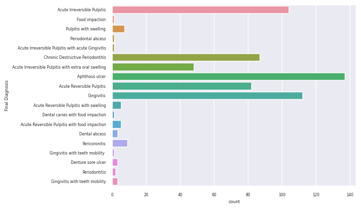
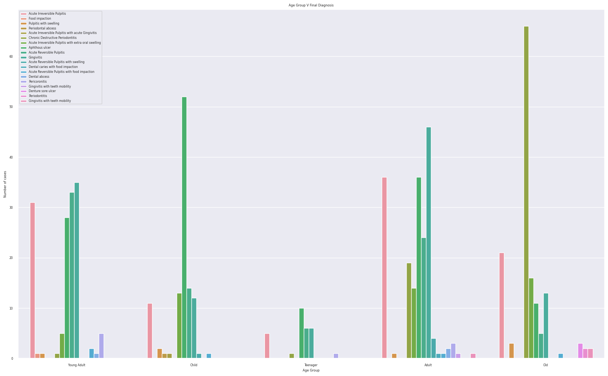
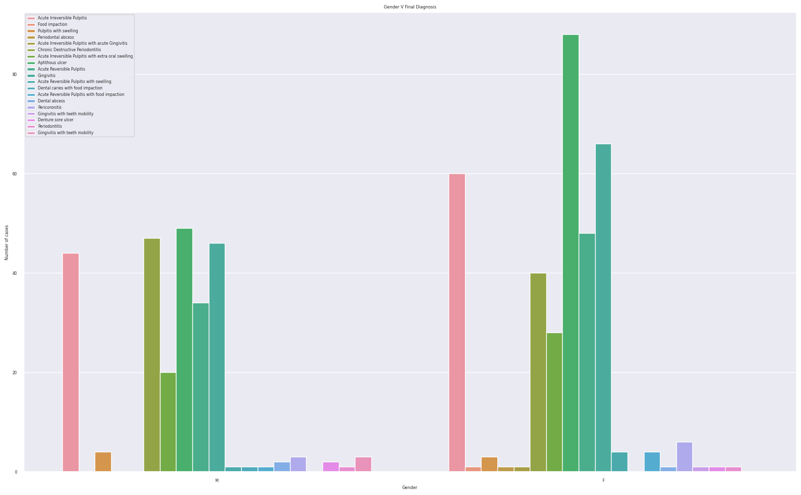

# A Novel Dataset for Dental Disease Prediction: Insights from Machine Learning and Deep Learning Algorithms

The study introduces a novel dataset for dental disease prediction. The available datasets at the moment comprise images for identifying different diseases. This novel dataset aims to add to the growing field of dental disease prediction by introducing a prediction based on patients' symptoms. This study aims to help people avoid misinformation from the internet and help practitioners provide quick diagnosis and treatment based on reliable accuracy scores. The dataset consists of 19 unique features and 28 unique diagnosis classes. There are 612 data entries at the moment of writing this manuscript with more data entries being made regularly. Multiple different supervised learning algorithms were used, with SVC giving the best results with an accuracy of 90.24%. A neural network was also made for this purpose and has given promising results, which is an accuracy of 91.06%.

The dataset is made up of questions asked by dentists during the initial patient screening. Aside from oral examination, these questions play an important role in the patient's diagnosis. Experienced dentists are able to deduce the possible diagnosis just from the initial questioning and more commonly instantly give the doctor what all the possible diseases are. This dataset would thus allow in the creation of machine learning models which would be able to tell what the patient is suffering from. A major problem in the field of medicine in general is misinformation and slow treatment time. As experienced dental practitioners have annotated this dataset, an unbiased diagnosis can be made. Also as this would also aid in speeding up the diagnosis which would allow the patient to enter the treatment phase faster.

From the dataset, interesting observations were made:

    

The most prominent final diagnosis in the community is Apthous Ulcer, followed by Acute Irreversible Pulpitis, Acute Gingivitis, and Acute Reversible Pulpitis.

Other important observations made include the relationship between Age, Gender and the final diagnosis

    

    

## Background Research Pre-Data Acquisition

The initial step in crafting our dataset involved pinpointing its crucial features. We sought the expertise of seasoned dental surgeons and practitioners in the area, initially approaching five individuals with roughly twenty years of experience under their belts. Two of these surgeons expressed a keen interest in collaborating with us. Through a week-long series of discussions, we embarked on a collaborative effort to identify the most pertinent questions typically asked during patient screening. Their invaluable insights proved instrumental in shaping the direction of our research.
Following their guidance, I had the privilege of meeting with the esteemed Head of the Department of Oral Medicine and Radiology at the District Medical College. This meeting proved to be a turning point, granting me a deeper understanding of the clinical nuances involved in patient screening and ultimately leading to a more refined set of questions. They also offered "Textbook of Oral Medicine" by S.R. Prabhu which proved to be a valuable resource for further exploration and reference.
Following this insightful encounter, we reconvened with the surgeons to share the refined set of questions and incorporate their final feedback. This iterative process ensured that the final dataset, consisting of 19 carefully chosen questions, effectively captured the essence of the patient screening process, laying a strong foundation for our subsequent research endeavors.

## Data Acquisition

The data entry was done using a Google Form. This was the chosen method as Google Forms offers an easy interface to the partnered dentists to enter the data. It is streamlined and less cumbersome. We were also able to generate an associated Google Spreadsheet which was then exported to .csv format to complete the dataset. The data was collected over a period of 4 months, from 31 October to 15th January.

You may find the python notebook for reference in this GitHub Repository
